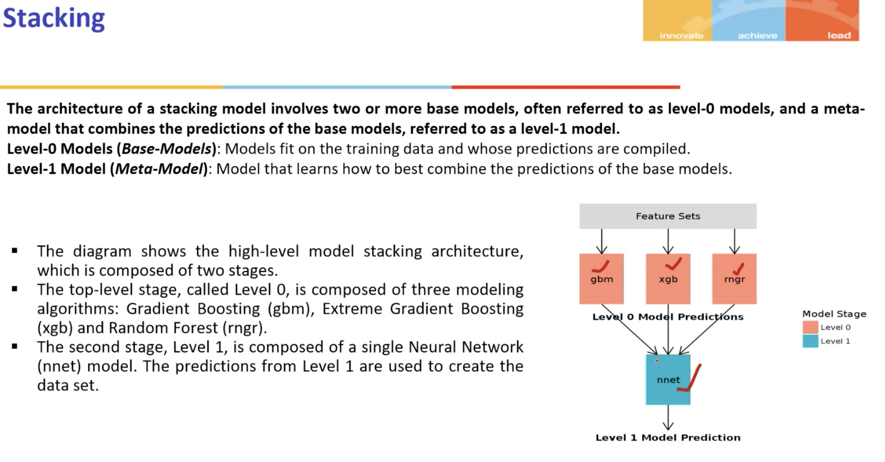

# Copyright Information

&copy; ankur.vatsa@gmail.com

# Supervised Learning

- Models trained on labeled data, and the goal is to learn a mapping from the input features to the output labels
- Dataset, from which models must learn, consists of input features and their corresponding output labels
- Models learns the relationship between the input features and the output labels by minimizing a loss function that measures the difference between the predicted and actual output labels

## Linear regression

### Introduction

- Simple and widely used regression technique that models relationship between a dependent variable and independent variables
- Assumes a linear relationship between the dependent variable and the independent variables
- The goal of linear regression is to find the best-fitting line that minimizes the sum of the squared differences between the observed and predicted values

### Algorithm

- Parameteric algoithm of the form y = b0 + b1 * x1 + b2*x2 + ... + bn*xn
- The linear regression algorithm works by finding the coefficients of the linear equation that best fits the data.
- Coefficients are estimated using the least squares method, which minimizes the sum of the squared differences between the observed and predicted values.
- Loss function: Mean Squared Error (MSE) = 1/n * sum((y - y_pred)^2)
- Optimization: Minimize the loss function using gradient descent or normal equation
- Normal equation: b = (XT * X)-1 * XT * y
- Gradient descent: b = b - ⍺ * $\frac{1}{n}$ * XT * (X * b - y)
- Predict the output of a new data point using the linear equation

### Variations

#### Simple linear regression

- One independent variable and one dependent variable
- Form: y = b0 + b1 * x1
- Loss function: Mean Squared Error (MSE) = 1/n * sum((y - ypred)^2)
- Optimization: Minimize the loss function using gradient descent or normal equation
- Gradient descent: 
  - b0 = b0 - ⍺ * $\frac{1}{n}$ * Σ(y - ypred)
  - b1 = b1 - ⍺ * $\frac{1}{n}$ * Σ((y - ypred) * x)

##### Numerical Example

- Dataset:
    x = [1, 2, 3, 4, 5]
    y = [2, 4, 6, 8, 10]
- Gradient Descent Iteration 1
  - b0 = 0, b1 = 0 (Assume initial values)
  - y_pred = 0 + 0*x = 0
  - Loss = 1/5 * (2² + 4² + 6² + 8² + 10²) = 30
  - b0 = 0 - ⍺ * $\frac{1}{5}$ * (2 + 4 + 6 + 8 + 10) = -5.0
  - b1 = 0 - ⍺ * $\frac{1}{5}$ * (2*1 + 4*2 + 6*3 + 8*4 + 10*5) = -15.0
- Gradient Descent Iteration 2
  - b0 = -5.0, b1 = -15.0 (Updated values)
  - y_pred = -5.0 + -15.0*x
  - Loss = 1/5 * (7² + 9² + 11² + 13² + 15²) = 110
  - b0 = -5.0 - ⍺ * $\frac{1}{5}$ * (7 + 9 + 11 + 13 + 15) = -10.0
  - b1 = -15.0 - ⍺ * $\frac{1}{5}$ * (7 * 1 + 9 * 2 + 11 * 3 + 13 * 4 + 15 * 5) = -30.0
- Equation (after 2nd iteration): y = -10.0 - 30.0 * x

#### Multiple linear regression

- Multiple independent variables and one dependent variable
- Form: y = b0 + b1 * x1 + b2 * x2 + ... + bn * xn
- Loss function: Mean Squared Error (MSE) = $\frac{1}{n}$ * Σ (y - y_pred)^2
- Optimization: Minimize the loss function using gradient descent or normal equation
- Gradient descent:
  - b0 = b0 - ⍺ * $\frac{1}{n}$ * Σ(y - ypred)
  - b1 = b1 - ⍺ * $\frac{1}{n}$ * Σ((y - ypred) * x1)
  - b2 = b2 - ⍺ * $\frac{1}{n}$ * Σ((y - ypred) * x2)
  - ...
  - bn = bn - ⍺ * $\frac{1}{n}$ * Σ((y - ypred) * xn)

##### Numerical Example

- Dataset:
    x1 = [1, 2, 3, 4, 5]
    x2 = [2, 4, 6, 8, 10]
    y = [3, 6, 9, 12, 15]

- Gradient Descent Iteration 1
  - b0 = 0, b1 = 0, b2 = 0 (Assume initial values)
  - ypred = 0 + 0*x1 + 0*x2 = 0
  - Loss = 1/5 * (3^2 + 6^2 + 9^2 + 12^2 + 15^2) = 75
  - b0 = 0 - ⍺ * $\frac{1}{5}$ * (3 + 6 + 9 + 12 + 15) = -7.5
  - b1 = 0 - ⍺ * $\frac{1}{5}$ * (3 * 1 + 6 * 2 + 9 * 3 + 12 * 4 + 15 * 5) = -22.5
  - b2 = 0 - ⍺ * $\frac{1}{5}$ * (3 * 2 + 6 * 4 + 9 * 6 + 12 * 8 + 15 * 10) = -45.0

- Gradient Descent Iteration 2
  - b0 = -7.5, b1 = -22.5, b2 = -45.0 (Updated values)
  - ypred = -7.5 - 22.5 * x1 - 45.0 * x2
  - Loss = $\frac{1}{5}$ * (62 + 92 + 122 + 152 + 182) = 105
  - b0 = -7.5 - ⍺ * $\frac{1}{5}$ * (6 + 9 + 12 + 15 + 18) = -10.5
  - b1 = -22.5 - ⍺ * $\frac{1}{5}$ * (6 * 1 + 9 * 2 + 12 * 3 + 15 * 4 + 18 * 5) = -27.0
  - b2 = -45.0 - ⍺ * $\frac{1}{5}$ * (6 * 2 + 9 * 4 + 12 * 6 + 15 * 8 + 18 * 10) = -54.0
- Equation (after 2nd iteration): y = -10.5 - 27.0 * x1 - 54.0 * x2

#### Polynomial regression: Non-linear relationship between the dependent and independent variables

- Ridge regression: Regularization to prevent overfitting
  - Loss function: Mean Squared Error (MSE) + ⍺ * Σ(b²)
  - ⍺: regularization strength parameter, controls the trade-off between fitting the data and preventing overfitting

- Lasso regression: Regularization to prevent overfitting and feature selection
  - Loss function: Mean Squared Error (MSE) + ⍺ * Σ|b|

- Elastic Net regression: Combination of Lasso and Ridge regression
  - Loss function: Mean Squared Error (MSE) + ⍺ * Σ(1 - λ) (b²) + λ * Σ|b|
  - ⍺: regularization strength parameter, controls the trade-off between fitting the data and preventing overfitting
  - λ: mixing parameter, controls the trade-off between Lasso and Ridge regression

### Advantages

- Simple and easy to implement
- Interpretable and easy to understand
- Fast and efficient
- Works well with linear data
- Provides a baseline model for comparison

### Disadvantages

- Assumes a linear relationship between the dependent and independent variables
- Sensitive to outliers
- May not work well with non-linear data
- May not capture complex relationships between variables
- May not handle multicollinearity well

### Applicability

- Sales forecasting: Predicting sales based on advertising spend
- Stock price prediction: Predicting stock prices based on historical data
- House price prediction: Predicting house prices based on location, size, and other features
- Customer churn prediction: Predicting customer churn based on customer behavior
- Demand forecasting: Predicting demand for products based on historical sales data

---

## Logistic regression

### Introduction

- Classification algorithm to model the relationship between a binary dependent variable and one or more independent variables
- Estimates the probability that the dependent variable is 1 given the independent variables
- Uses the logit function to map the linear combination of the independent variables to the probability of the dependent variable being 1
- Form: p = $\frac{1}{1 + exp(-z)}$, where z = b0 + b1 * x1 + b2 * x2 + ... + bn * xn
- Odds ratio: $\frac{p}{1 - p}$, where p is the probability of the dependent variable being 1
- Log odds: log(odds) = log($\frac{p}{1 - p}$) = b0 + b1 * x1 + b2 * x2 + ... + bn * xn
- Loss function: Log Loss = -$\frac{1}{n}$ * Σ(y * log(p) + (1 - y) * log(1 - p))
- Optimization: Minimize the loss function using Gradient Descent or Newton's method
- Gradient Descent: b = b - ⍺ * $\frac{1}{n}$ * XT * (p - y)

##### Numerical Example

- Dataset:
    x = [1, 2, 3, 4, 5]
    y = [0, 0, 1, 1, 1]
- Form: p = $\frac{1}{1 + exp(-z)}$, where z = b0 + b1*x
- Gradient Descent Iteration 1
  - b0 = 0, b1 = 0 (Assume initial values)
  - z = 0 + 0*x = 0
  - p = $\frac{1}{1 + exp(-z)}$ = 0.5
  - Loss = -$\frac{1}{5}$ * (0*log(0.5) + 0*log(0.5) + 1*log(0.5) + 1*log(0.5) + 1*log(0.5)) = -0.693
  - b0 = 0 - ⍺ * $\frac{1}{5}$ * (0 + 0 + 1 + 1 + 1) = 0.6
  - b1 = 0 - ⍺ * $\frac{1}{5}$ * (0*1 + 0*2 + 1*3 + 1*4 + 1*5) = 1.8
- Gradient Descent Iteration 2
  - b0 = 0.6, b1 = 1.8 (Updated values)
  - z = 0.6 + 1.8 * x
  - p = $\frac{1}{1 + exp(-z)}$
  - Loss = -$\frac{1}{5}$ * (0*log(p) + 0*log(p) + 1*log(p) + 1*log(p) + 1*log(p))
  - b0 = 0.6 - ⍺ * $\frac{1}{5}$ * (0 + 0 + 1 + 1 + 1)
  - b1 = 1.8 - ⍺ * $\frac{1}{5}$ * (0*1 + 0*2 + 1*3 + 1*4 + 1*5)
- Equation (after 2nd iteration): p = 0.6 + 1.8*x

### Advantages

- Simple and easy to implement
- Interpretable and easy to understand
- Fast and efficient
- Works well with binary data
- Provides probabilities as output

### Disadvantages

- Assumes a linear relationship between the independent variables and the log odds of the dependent variable
- Sensitive to outliers
- May not work well with non-linear data
- May not handle multicollinearity well
- May not capture complex relationships between variables

### Applicability

- Customer churn prediction: Predicting customer churn based on customer behavior
- Fraud detection: Detecting fraudulent transactions based on transaction data
- Credit risk assessment: Assessing credit risk based on financial data
- Disease prediction: Predicting the likelihood of a disease based on medical data
- Sentiment analysis: Analyzing sentiment in text data

---

## Decision Trees

### Introduction

- Popular and widely used classification algorithm to model the relationship between a dependent variable and one or more independent variables
- Uses a tree-like structure to represent the decision-making process
- Each node in the tree represents a decision based on the value of an independent variable
- The tree is built by recursively partitioning the data into subsets based on the values of the independent variables
- The algorithm selects the best split at each node based on a criterion such as information gain or Gini impurity
- Stopping Conditions:
  - data is perfectly classified
  - one of the following is reached:
    - maximum or pre-decided depth of the tree
    - minimum number of samples in a node
    - minimum number of samples in a leaf node
    - maximum number of leaf nodes
    - minimum impurity decrease
    - maximum number of features

### Numerical Example

#### Dataset:
X1    | X2  |   Y
----:|----:|---: |
1  | 2  | 0
2  | 4  | 0
3  | 6  | 1
4  | 8  | 1
5  | 10 | 1
- Calculate the information gain for each split
  - Step1: Split on x1 = 2: Information Gain = Entropy(y) - (2/5 * Entropy(y1) + 3/5 * Entropy(y2))
  - Step2: Split on x1 = 3: Information Gain = Entropy(y) - (1/5 * Entropy(y1) + 4/5 * Entropy(y2))

### Advantages

- Simple and easy to interpret
- Can handle both numerical and categorical data
- Can capture non-linear relationships between variables
- Can handle missing values
- Can handle multicollinearity

### Disadvantages

- Prone to overfitting
- Sensitive to noise
- May not work well with imbalanced data
- May not capture complex relationships between variables
- May not handle continuous data well

### Applicability

- Customer segmentation: Retail (segmenting customers based on purchasing behaviour), E-commerce (segmenting customers based on browsing behavior), Healthcare (segmenting patients based on health data for personalized treatment)
- Anomaly detection: Cybersecurity (detecting unusual network traffic patterns and intrusions), Manufacturing (detecting defective products on production line)
- Image analysis: Image segmentation, object recognition
- Document clustering: Text clustering, document classification
- Fraud detection: Credit card fraud detection, insurance fraud detection

---

## K Nearest Neighbors (KNN) - Instance Based Learning

### Introduction

- Popular and simple classification algorithm, assigns a class to a query point based on the class of its K nearest neighbors
- The class of the query point is assigned based on the majority class of the neighbors
- The KNN algorithm assigns equal weights to all the neighbors, regardless of their distance from the query point

### Algorithm

- Calculate the distance between the query point and each training example
- Select the K nearest neighbors based on the distance
- Assign the class of the query point based on the weighted average

### Numerical Example

- *Query point:* x = (3, 24)
- *Choose K:* 5
- *Distance Metric:* Euclidean Distance

#### Dataset:

X1    | X2  |   Y   |   Distance²   | Rank
----:|----:|---:| ---:  | ---: |
1  | 12  | 0 | (3 - 1)² + (24 - 12)² = 148 | 6
2  | 41  | 0 | (3 - 2)² + (24 - 41)² = 290 | 8
4  | 16  | 1 | (3 - 4)² + (24 - 16)² = 65  | 3
5  | 11 | 1 | (3 - 5)² + (24 - 11)² = 173 | 7
6  | 23 | 1 | (3 - 6)² + (24 - 23)² = 10  | 1
7  | 34 | 1 | (3 - 7)² + (24 - 34)² = 116 | 5
8  | 22 | 1 | (3 - 8)² + (24 - 22)² = 29  | 2
9  | 31 | 0 | (3 - 9)² + (24 - 31)² = 85  | 4

- Majority Class: 1 (within the 5 nearest neighbors), hence the query point is classified as 1

### Advantages

- Simple and easy to implement
- Non-parametric and does not make assumptions about underlying data distribution
- Handles numerical and categorical data
- Captures non-linear relationships between variables
- Handles missing values

### Disadvantages

- Computationally expensive: Requires the calculation of distances for each training example
- Sensitive to the choice of K
- Sensitive to the distance metric
- May not work well with high-dimensional data
- May not work well with imbalanced data

### Applicability

- Customer segmentation: Retail (segmenting customers based on purchasing behaviour), E-commerce (segmenting customers based on browsing behavior), Healthcare (segmenting patients based on health data for personalized treatment)
- Anomaly detection: Cybersecurity (detecting unusual network traffic patterns and intrusions), Manufacturing (detecting defective products on production line)
- Image analysis: Image segmentation, object recognition
- Document clustering: Text clustering, document classification
- Fraud detection: Credit card fraud detection, insurance fraud detection

### Variations

- Distance Weighted KNN
- Locally Weighted Regression

## Distance Weighted KNN

### Introduction

- Assigns weights to the neighbors based on their distance from the query point
- The weight is inversely proportional to the distance
- The weight is used to calculate the weighted average of the neighbors
- The class of the query point is assigned based on the weighted average

## Algorithm

- Calculate the distance of each neighbor from the query point
- Assign weights to the neighbors based on their distance
- Calculate the weighted average of the neighbors
- Assign the class of the query point based on the weighted average

## Numerical Example

- *Query point:* x = (3, 24)
- *Choose K:* 5
- *Choose Distance Metric:* Euclidean Distance
- *Other applicable distance metrics:* 
  - *Manhattan Distance:* Σ|xi - x0i|
  - *Minkowski Distance:* (Σ|xi - x0i|^p)^(1/p)
  - *Hamming Distance:* Number of positions at which the corresponding elements are different
  - *Mahalanobis Distance:* √((x - x0) * Σ-1 * (x - x0))

#### Dataset:

X1    | X2  |   Y   |   Distance²   | Rank | Weight | Weighted Y
----:|----:|---:| ---:  | ---: | ---: | ---: |
1  | 12  | 0 | (3 - 1)² + (24 - 12)² = 148 | 6 | 1/148 | 1/148 * 0 = 0 
2  | 41  | 0 | (3 - 2)² + (24 - 41)² = 290 | 8 | 1/290 | 1/290 * 0 = 0
4  | 16  | 1 | (3 - 4)² + (24 - 16)² = 65  | 3 | 1/65 | 1/65 * 1 = 1/65
5  | 11 | 1 | (3 - 5)² + (24 - 11)² = 173 | 7 | 1/173 | 1/173 * 1 = 1/173
6  | 23 | 1 | (3 - 6)² + (24 - 23)² = 10  | 1 | 1/10 |  1/10 * 1 = 1/10
7  | 34 | 1 | (3 - 7)² + (24 - 34)² = 116 | 5 | 1/116 | 1/116 * 1 = 1/116
8  | 22 | 1 | (3 - 8)² + (24 - 22)² = 29  | 2 | 1/29 | 1/29 * 1 = 1/29
9  | 31 | 0 | (3 - 9)² + (24 - 31)² = 85  | 4 | 1/85 | 1/85 * 0 = 0
Sum|    |   |               |     | 2 | Sum(Weighted Y)

- Weighted Average: $\frac{\frac{1}{148} * 0 + \frac{1}{290} * 0 + \frac{1}{65} * 1 + \frac{1}{173} * 1 + \frac{1}{10} * 1}{\frac{1}{148} + \frac{1}{290} + \frac{1}{65} + \frac{1}{173} + \frac{1}{10}}$ = 0.5

## Advantages

- Effective in reducing the impact of outliers
- Suitable for datasets with a small number of neighbors
- Takes into account the distance of the neighbors from the query point
- Assigns higher weights to the neighbors that are closer to the query point
- Reduces the impact of outliers
- Improves accuracy of KNN algorithm, neighbors closer to the query point are given more weight as they are more likely to be similar to the query point

## Disadvantages

- Computationally expensive: Requires the calculation of distances and weights for each neighbor
- May not perform well with high-dimensional data
- Encounters issues with imbalanced datasets

## Applicability

- Classification problems like customer segmentation, fraud detection, and anomaly detection

## Locally Weighted Regression

### Algorithm

- Choose a kernel function
  - Gaussian Kernel: e-0.5 * $\frac{(x - x0)²}{τ²}$, τ is the bandwidth parameter
  - Tri-cube Kernel: (1 - |x - x0|³)³
  - Epanechnikov Kernel: 0.75 * (1 - (x - x0)²)
  - Uniform Kernel: 0.5 when |x - x0| <= 1, 0 otherwise
  - Quartic Kernel: (1 - (x - x0)²)²
  - Triangular Kernel: 1 - |x - x0|
  - Cosine Kernel: 0.5 * cos(($\frac{π}{2}$ * (x - x0))
  - Logistic Kernel: 1 / (ex + 2 + e-x)
  - Silverman's Kernel: 0.5 * e(-|x - x0| / τ)
- Calculate weights for each training example based on the kernel function
- Calculate the output of the query point using the weighted average of the training examples
- τ is selected based on methods like cross-validation, AIC, BIC, etc.

## Numerical Example

- Query point: x = (3, 24)
- Kernel Function: Gaussian Kernel = e(-0.5 * (x - x0)² / τ²)

#### Dataset
X1    | X2  |   Y   |   Distance²   | Weight
----:|----:|---:| ---:  | ---: |
1  | 12  | 0 | (3 - 1)² + (24 - 12)² = 148 | 1/148 
2  | 41  | 0 | (3 - 2)² + (24 - 41)² = 290 | 1/290
4  | 16  | 1 | (3 - 4)² + (24 - 16)² = 65  | 1/65
5  | 11 | 1 | (3 - 5)² + (24 - 11)² = 173 | 1/173
6  | 23 | 1 | (3 - 6)² + (24 - 23)² = 10  | 1/10
7  | 34 | 1 | (3 - 7)² + (24 - 34)² = 116 | 1/116
8  | 22 | 1 | (3 - 8)² + (24 - 22)² = 29  | 1/29
9  | 31 | 0 | (3 - 9)² + (24 - 31)² = 85  | 1/85

## Advantages

- Takes into account the distance of the training examples from the query point
- Assigns higher weights to the training examples that are closer to the query point
- Reduces the impact of outliers
- Improves the accuracy of the regression model
- Difference w.r.t KNN: LWLR assigns weights to the training examples based on their distance from the query point, while KNN assigns weights to the neighbors based on their distance from the query point.

## Disadvantages

- Computationally expensive: Requires the calculation of distances and weights for each training example.
- May not perform well with high-dimensional data
- Issues with imbalanced datasets: For a dataset with more examples of one class than the other, the weights may be biased towards the class with more examples.

## Applicability

- Used in regression problems where the distance of the training examples from the query point is important
- Suitable for datasets with a small number of training examples
- Effective in reducing the impact of outliers
- Improves the accuracy of the regression model by assigning higher weights to the training examples that are closer to the query point. This ensures that the model is more sensitive to the training examples that are relevant to the query point.

## Radial Basis Functions

### Introduction

- RBF: A function that transforms the input space into a higher-dimensional space using a kernel function
  - Gaussian RBF: e(-γ * ||x - x0||²)
  - Multiquadric RBF: √(||x - x0||² + c²)
  - Inverse Multiquadric RBF: $\frac{1}{√(||x - x0||² + c²)}$
  - Thin Plate Spline RBF: ||x - x0||² * log(||x - x0||)
  - Wendland Compactly Supported RBF: $\frac{(1 - ||x - x0||)⁷ * (35 * ||x - x0||² + 18 * ||x - x0|| + 3}{3}$

## Algorithm

- A radial basis function (RBF) is a function that assigns a weight to each training example based on its distance from the query point.
- The weight is calculated using a kernel function.
- The weight is used to calculate the output of the query point.
- The output of the query point is a linear combination of the weights and the training examples.

## Algorithm

- Choose a kernel function
- Assign weights to the training examples based on their distance from the query point
- The weight is calculated using a kernel function
- The weight is used to calculate the output of the query point
- The output of the query point is a linear combination of the weights and the training examples

## Numerical Example

## Advantages

- Takes into account the distance of the training examples from the query point.
- Assigns higher weights to the training examples that are closer to the query point.
- Reduces the impact of outliers.
- Improves the accuracy of the regression model.
- Difference w.r.t KNN: RBF assigns weights to the training examples based on their distance from the query point, while KNN assigns weights to the neighbors based on their distance from the query point.

## Disadvantages

- Computationally expensive: Requires the calculation of distances and weights for each training example.
- May not perform well with high-dimensional data
- Issues with imbalanced datasets: For a dataset with more examples of one class than the other, the weights may be biased towards the class with more examples.

## Applicability

- Used in regression problems where the distance of the training examples from the query point is important
- Suitable for datasets with a small number of training examples
- Effective in reducing the impact of outliers
- Improves the accuracy of the regression model by assigning higher weights to the training examples that are closer to the query point. This ensures that the model is more sensitive to the training examples that are relevant to the query point.

## Choice of Centers

- Centers are the points in the input space around which the RBFs are centered.
- The centers can be chosen randomly, using k-means clustering, or using other methods.
- The choice of centers can affect the performance of the RBF network by influencing the coverage of the input space. e.g. If the centers are too far apart, the RBF network may not be able to capture the local structure of the data. If the centers are too close together, the RBF network may overfit the data.

# Radial Basis Function Networks

## Support Vector Machines

### Introduction

- *Support vectors:* data points that lie on the margin or within the margin of the hyperplane
- *Hyperplane:* Decision boundary that separates the data into different classes, wT * x + b = 0
  - +ve class: wT * x + b >= 1
  - -ve class: wT * x + b <= -1
- *Margin:* distance between the hyperplane and the support vectors
  - Margin = $\frac{2}{||w||}$
  - Maximizing margin leads to minimizing the generalization error
- *Goal:* Find the hyperplane that maximizes the margin between the support vectors
- *Optimization:* Minimize $\frac{1}{2}$ * ||w||² subject to yi * (wT * x_i + b) >= 1
- *Soft Margin SVM:* Introduce slack variables to allow for misclassification
- *Kernel trick:* Transform the data into a higher-dimensional space to make it linearly separable
- *Common kernels:* Linear, Polynomial, Radial Basis Function (RBF), Sigmoid
- *Kernel function:* K(x, x') = φ(x) * φ(x')
- *Dual optimization:* Solve the dual optimization problem to find the Lagrange multipliers
- *Prediction:* Predict the class of a new data point based on the sign of wT * x + b
- *Types of SVM:* Linear SVM and Non-linear SVM

## Linear SVM

### Algorithm

- For linear SVM algorithm to work, the data should be linearly separable
- The prediction is made based on the sign of w^T * x + b
  - wT * x + b >= 0, the data point belongs to one class
  - wT * x + b < 0, the data point belongs to the other class
- Lagrangian function: L(w, b, α) = $\frac{1}{2}$ * ||w||² - Σαi * (yi * (wT * xi + b) - 1)
- Dual optimization: Maximize Σαi - $\frac{1}{2}$ * ΣΣαi * αj * yi * yj * (xiT * xj)
- The optimization problem is solved using the Lagrange multipliers
- Solve for w, b, and α
- Find the equation of the hyperplane: wT * x + b = 0
- Predict the class of a new data point based on the sign of wT * x + b

### Slack Variables, Soft and Hard Margin SVM

- Soft Margin SVM (C = $\frac{1}{λ}$, where λ is the regularization strength parameter): Allows for a certain number of misclassifications
- Hard Margin SVM (C = 0): Does not allow for any misclassifications
- C: Regularization parameter that controls the trade-off between maximizing the margin and minimizing the misclassification
- Large C: Emphasizes minimizing the misclassification
- Small C: Emphasizes maximizing the margin
- Slack variables: ξi: Measure of how much a data point violates the margin
- Soft Margin SVM optimization: Minimize $\frac{1}{2}$ * ||w||² + C * Σξi subject to yi * (wT * xi + b) >= 1 - ξi

### Non-Linear SVM

The following issues are encountered with linear SVM

- Sensitive to noise: Outliers can affect the decision boundary
- Not suitable for non-linear data: Linear SVM cannot capture non-linear relationships between variables
- Memory inefficiency: Linear SVM requires storing the entire dataset in memory
- Choice of Kernel affects the performance of the SVM by influencing the complexity of the decision boundary
- Kernel parameters need to be tuned to achieve optimal performance
- Optimization criterion may not be convex, leading to local minima

Hence, Non-Linear SVM is used to address these issues.

#### Algorithm

- Non-linear SVM uses the kernel trick to transform the data into a higher-dimensional space where it is linearly separable
- Common kernels: Polynomial, Radial Basis Function (RBF), Sigmoid
- Kernel function: K(x, x') = φ(x) * φ(x')

# Naive Bayes Classifier

## Algorithm

- NB is a popular and simple probabilistic classifier based on Bayes theorem with naive assumption of the features.
- Assumes that the presence of a particular feature in a class is unrelated to the presence of any other feature.
- e.g. A fruit may be considered to be an apple if it is red, round, and about 3 inches in diameter. Even if these features depend on each other or upon the existence of the other features.
- This assumption simplifies computation and makes the model interpretable and computationally efficient.

## Numerical Example

## Advantages

- Simple and easy to implement
- Fast and efficient
- Works well with high-dimensional data
- Handles missing values well
- Good for categorical data
- Good for text classification

## Disadvantages

- Assumes independence of features
- Zero frequency problem
- Resolved with Laplace smoothing: Add 1 to each count and add the number of classes to the denominator.
- Sensitive to the scale of the data
- Cannot learn interactions between features
- Cannot handle continuous data
- Cannot handle unseen data

## Applicability

- Text classification: Spam detection, sentiment analysis, document clustering / classification (Topic classification, author identification, language detection), fake news detection, Customer review analysis (Sentiment analysis, opinion mining), Product recommendation(E-commerce product recommendation, movie recommendation)
- Recommendation systems: Collaborative filtering, content-based filtering
- Medical diagnosis: Disease prediction, patient classification
- Fraud detection: Credit card fraud detection, insurance fraud detection
- Customer segmentation: Market segmentation, customer profiling

# Ensemble Learning

## Bagging

- Bootstrap Aggregating
- Random Forest

## Boosting

- AdaBoost
- Gradient Boosting
- XGBoost

## Stacking

### Introduction

- Ensemble learning technique that combines multiple models via an external meta-model/meta-classifier/meta-regressor to improve the performance of the overall model.
- The base models are trained on the training data and their predictions are used as input features for the stack generalization meta-model.
- Base models are of different types, and are trained on different subsets of training data
- Difference w.r.t bagging and boosting: Combines the predictions of multiple models rather than combining the models themselves.
- Benefit: Stacking captures the strengths of different models and improves the overall performance of the model as compare to any one of the individual models.

### Algorithm

- Stacking begins by training multiple diverse base models on the training data. 
- Common base learners: Decision Trees, Support Vector Machines, Random Forest, Gradient Boosting, Neural Networks, K-Nearest Neighbors, Logistic Regression, Naive Bayes, etc.
- Holdout data: A portion of the training data is set aside as holdout data to train the meta-model.

### Numerical Example

### Advantages

### Disadvantages

### Applicability

---
---
---

# Unsupervised Learning

- The model is trained on unlabeled data, and the goal is to discover hidden patterns or structures in the data
- The goal is to learn underlying structure of the data and extract patterns from it without the need for labeled data
- Unsupervised learning is used for clustering, dimensionality reduction, and anomaly detection
- Common unsupervised learning algorithms include K-Means Clustering, Hierarchical Clustering, Gaussian Mixture Models (GMM), and Expectation-Maximization (EM) Algorithm

## K-Means Clustering

### Introduction

- Clustering is dividing a set of data points into groups based on their similar features
- It organizes data into classes that maximize the intra-class similarity and minimize the inter-class similarity
- K-Means is a popular clustering algorithm that partitions the data into K clusters
- The algorithm iteratively assigns data points to the nearest cluster center and updating the cluster centers based on the mean of the data points assigned to the cluster
- The algorithm converges when the cluster centers do not change significantly between iterations
- The "number of clusters" (i.e. K) is a user specified hyperparameter

### Algorithm

### Numerical Example

- Dataset: X = [1, 2, 3, 4, 5, 6, 7, 8, 9, 10, 11]
- Step1: Initialize K = 3 cluster centers, e.g [2, 5, 8]
- Step2: Assign each data point to the nearest cluster center
X | C1 Distance | C2 Distance | C3 Distance | Assigned Cluster
---: | ---: | ---: | ---: | ---:
1 | 1 | 4 | 7 | C1
2 | 0 | 3 | 6 | C1
3 | 1 | 2 | 5 | C1
4 | 2 | 1 | 4 | C2
5 | 3 | 0 | 3 | C2
6 | 4 | 1 | 2 | C2
7 | 5 | 2 | 1 | C3
8 | 6 | 3 | 0 | C3
9 | 7 | 4 | 1 | C3
10 | 8 | 5 | 2 | C3
11 | 9 | 6 | 3 | C3

- Step3: Update the cluster centers based on the mean of the data points assigned to the cluster
C1 = [1, 2, 3], C2 = [4, 5, 6], C3 = [7, 8, 9, 10, 11]
Updating Cluster Centers:
C1 = 1 + 2 + 3 / 3
C1 = 2

C2 = 4 + 5 + 6 / 3
C2 = 5

C3 = 7 + 8 + 9 + 10 + 11 / 5
C3 = 9

C1 = 2, C2 = 5, C3 = 9

- Step4: Repeat steps 2 and 3 until the cluster centers do not change significantly between iterations
New centers: [2, 5, 9]
X | C1 Distance | C2 Distance | C3 Distance | Assigned Cluster
---: | ---: | ---: | ---: | ---:
1 | 1 | 4 | 8 | C1
2 | 0 | 3 | 7 | C1
3 | 1 | 2 | 6 | C1
4 | 2 | 1 | 5 | C2
5 | 3 | 0 | 4 | C2
6 | 4 | 1 | 3 | C2
7 | 5 | 2 | 2 | C3
8 | 6 | 3 | 1 | C3
9 | 7 | 4 | 0 | C3
10 | 8 | 5 | 1 | C3
11 | 9 | 6 | 2 | C3

- Step5: The algorithm converges when the cluster centers do not change significantly between iterations
Updating Cluster centers:

C1 = 1 + 2 + 3 / 3
C1 = 2

C2 = 4 + 5 + 6 / 3
C2 = 5

C3 = 7 + 8 + 9 + 10 + 11 / 5
C3 = 9

- Step 6: Sincen the cluster centers do not change significantly between iterations, the algorithm converges
- The final clusters are: C1 = [1, 2, 3], C2 = [4, 5, 6], C3 = [7, 8, 9, 10, 11]
- With the cluster centers [2, 5, 9] respectively

### Advantages

- Simple and easy to implement
- Fast and efficient
- Scales well to large datasets
- Works well with numerical data
- Can handle high-dimensional data
- Works well with clusters of similar sizes and densities but not with clusters of different sizes and densities

### Disadvantages

- Requires the number of clusters K to be specified
- Sensitive to the initial cluster centers
- May converge to a local minimum
- May not work well with non-linear data
- May not work well with clusters of different sizes and densities
- May not work well with high-dimensional data

### Applicability

- Customer segmentation: Retail (segmenting customers based on purchasing behaviour), E-commerce (segmenting customers based on browsing behavior), Healthcare (segmenting patients based on health data for personalized treatment)
- Anomaly detection: Cybersecurity (detecting unusual network traffic patterns and intrusions), Manufacturing (detecting defective products on production line)
- Dimensionality reduction: Image and video processing (compressing images and videos for storage and transmission while preserving quality), Gene Expression Analysis (reducing the dimensionality of gene expression data for visualization and analysis)
- Market basket analysis: Retail (identifying products that are frequently purchased together for targeted marketing), E-commerce (recommending products based on past purchase behavior)
- Topic modeling and Document clustering: Text mining (grouping similar documents for topic modeling and sentiment analysis), Information retrieval (organizing search results into clusters for better user experience)

## K-Means++ Clustering

### Introduction

- K-Means++ is an improved version of the K-Means clustering algorithm that addresses the issue of the sensitivity of the initial cluster centers
- The algorithm selects the initial cluster centers in a way that maximizes the distance between the cluster centers
- The algorithm iteratively selects the next cluster center based on the probability of a data point being chosen as the next cluster center
- The algorithm converges when the cluster centers do not change significantly between iterations

### Algorithm

- Initialize the first cluster center randomly
- For each data point, calculate the distance to the nearest cluster center
- Select the next cluster center based on the probability of a data point being chosen as the next cluster center
- Repeat steps 2 and 3 until K cluster centers are selected
- Assign each data point to the nearest cluster center
- Update the cluster centers based on the mean of the data points assigned to the cluster

### Numerical Example

- Dataset: X = [1, 2, 3, 4, 5, 6, 7, 8, 9, 10, 11]
- Step1: Initialize the first cluster center randomly, e.g. 2
- Step2: For each data point, calculate the distance to the nearest cluster center
X | Distance to C1 | Probability
---: | ---: | ---:
1 | 1 | 1
2 | 0 | 0
3 | 1 | 1
4 | 2 | 0.5
5 | 3 | 0.33
6 | 4 | 0.25
7 | 5 | 0.2
8 | 6 | 0.17
9 | 7 | 0.14
10 | 8 | 0.12
11 | 9 | 0.11

?????

## Hierarchical Clustering

### Algorithm

- Hierarchical clustering is a clustering algorithm that builds a hierarchy of clusters.
- The algorithm starts with each data point as a separate cluster and merges the closest clusters iteratively until all data points belong to a single cluster.
- The hierarchy of clusters can be visualized as a dendrogram.

### Numerical Example

### Advantages

- Does not require the number of clusters to be specified
- Can handle clusters of different sizes and shapes
- Provides a hierarchy of clusters
- Can be visualized as a dendrogram

### Disadvantages

- Computationally expensive
- Sensitive to noise and outliers
- May not work well with high-dimensional data
- May not work well with non-Euclidean data

### Applicability

- Biology: Phylogenetic analysis, gene expression analysis
- Marketing: Customer segmentation, market segmentation
- Image analysis: Image segmentation, object recognition
- Document clustering: Text clustering, document classification
- Anomaly detection: Network intrusion detection, fraud detection

## Gaussian Mixture Models (GMM)

### Introduction

- Gaussian Mixture Models (GMM) is a probabilistic model that represents the data as a mixture of Gaussian distributions.
- The model assumes that the data is generated by a mixture of K Gaussian distributions, each with its own mean and covariance matrix.
- The model can be used for clustering, density estimation, and anomaly detection.

### Algorithm

- The GMM algorithm works by iteratively estimating the parameters of the Gaussian distributions that best fit the data.
- The parameters include the mean, covariance matrix, and mixing coefficients of each Gaussian distribution.
- The algorithm uses the Expectation-Maximization (EM) algorithm to estimate the parameters.
- The EM algorithm alternates between the E-step, where the posterior probabilities of the data points belonging to each Gaussian distribution are calculated, and the M-step, where the parameters of the Gaussian distributions are updated based on the posterior probabilities.

### Numerical Example

### Advantages

- Can model complex data distributions
- Can handle clusters of different sizes and shapes
- Provides a probabilistic framework for clustering
- Can be used for density estimation and anomaly detection

### Disadvantages

- Computationally expensive
- Sensitive to the choice of the number of components
- May not work well with high-dimensional data
- May not work well with non-Gaussian data

### Applicability

- Clustering: Image segmentation, document clustering
- Density estimation: Anomaly detection, outlier detection
- Dimensionality reduction: Feature extraction, data visualization
- Data generation: Data synthesis, data augmentation
- Missing data imputation: Data completion, data recovery

## Expectation-Maximization (EM) Algorithm

### Introduction

- Expectation-Maximization (EM) is a general algorithm for estimating the parameters of probabilistic models with latent variables.
- The algorithm alternates between the E-step, where the posterior probabilities of the latent variables are calculated, and the M-step, where the parameters of the model are updated based on the posterior probabilities.
- The EM algorithm is used in a wide range of applications, including clustering, density estimation, and missing data imputation.

### Algorithm

- Initialize the parameters of the model.
- E-step: Calculate the posterior probabilities of the latent variables given the observed data and the current parameters.
- M-step: Update the parameters of the model based on the posterior probabilities.
- Repeat the E-step and M-step until the parameters converge.

### Numerical Example

### Advantages

- Can estimate the parameters of complex probabilistic models
- Can handle missing data and latent variables
- Provides a general framework for parameter estimation
- Converges to a local maximum of the likelihood function

### Disadvantages

- Computationally expensive
- Sensitive to the choice of the initial parameters
- May not converge to the global maximum of the likelihood function
- May require a large number of iterations to converge

### Applicability

- Clustering: Gaussian Mixture Models, K-Means Clustering
- Density estimation: Gaussian Mixture Models, Kernel Density Estimation
- Missing data imputation: Data completion, data recovery
- Latent variable modeling: Factor analysis, Hidden Markov Models
- Anomaly detection: Outlier detection, fraud detection

## Principal Component Analysis (PCA)

### Introduction

- Principal Component Analysis (PCA) is a dimensionality reduction technique that transforms the data into a lower-dimensional space while preserving the variance of the data.
- The goal of PCA is to find the directions in which the data varies the most and project the data onto these directions.
- The principal components are the eigenvectors of the covariance matrix of the data, and the corresponding eigenvalues represent the amount of variance explained by each principal component.

### Algorithm

- Calculate the mean of the data and center the data by subtracting the mean.
- Calculate the covariance matrix of the centered data.
- Compute the eigenvectors and eigenvalues of the covariance matrix.
- Sort the eigenvectors by their corresponding eigenvalues in descending order.
- Select the top k eigenvectors as the principal components.
- Project the data onto the principal components to obtain the lower-dimensional representation.

### Numerical Example

### Advantages

- Reduces the dimensionality of the data
- Preserves the variance of the data
- Removes redundant features
- Improves the interpretability of the data
- Speeds up the training of machine learning models

### Disadvantages

- Assumes linear relationships between variables
- May not work well with non-linear data
- May not capture complex relationships between variables
- May not handle multicollinearity well
- May not handle missing data well

### Applicability

- Dimensionality reduction: Feature extraction, data visualization
- Data preprocessing: Data cleaning, data compression
- Anomaly detection: Outlier detection, fraud detection
- Image processing: Image compression, image denoising
- Signal processing: Signal denoising, signal compression
